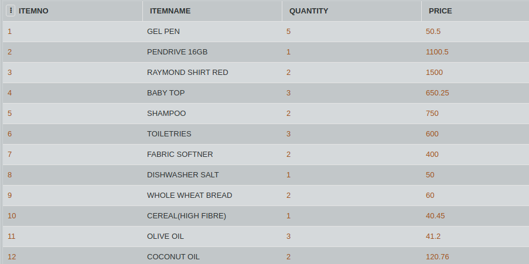

# SQL Challenge- Spent on Shopping

Veronica is a shopaholic and loves spending her money on buying stuffs. The cashier at the store is weak in mathematics and is unable to calculate the total bill. Let's help the cashier in calculating the total amount using SQL commands.

Consider the following table BILL which contains information about the expenditure. Write an SQL query to display the sum total of the column PRICE and also display the rounded figure of the amount.

####Table: BILL

