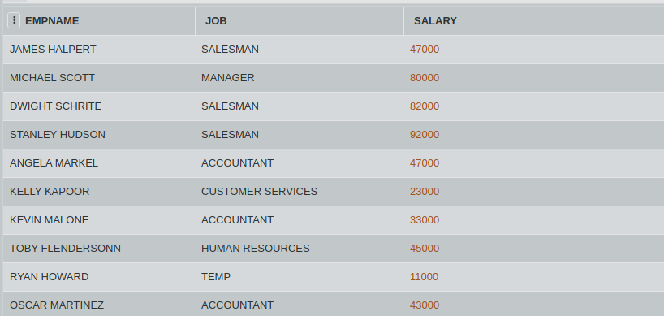

## SQL Challenge - TOP AND BOTTOM TWO'S

Gabe from Sabre has been assigned the task to find out the best two performers and the worst two performers in the Scranton branc. The only way to determine this is by comparing the salaries of the employees. 

Consider the table JOBS. Write an SQL query to retrieve two maximum and two minimum salaries from the table JOBS without using MIN or MAX.

#### Table: JOBS

