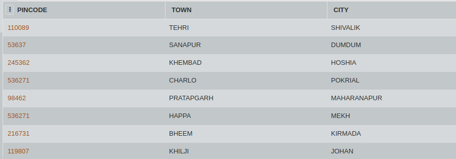

## SQL Challenge - Length Problem

You are travelling by train and its a really long journey. After a while you get bored , and now you think of challenging yourself to pass some time. You note down all the places that occur during the train journey and try to find out the city with the longest and shortest length.

Consider the table CITY. Write an SQL query to find out the city with the maximum letters and minimum letters (without the use of MIN() and MAX() func).

#### Table: CITY

