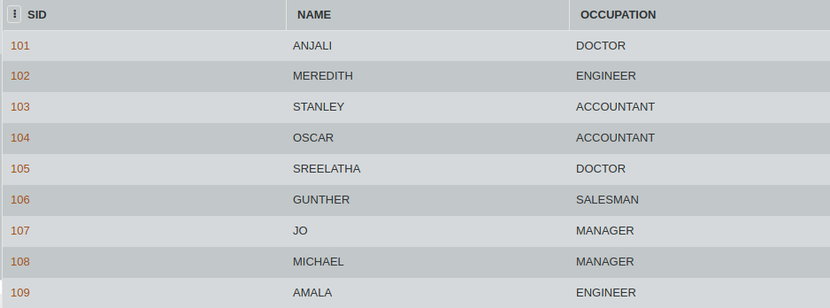

## SQL Challenge - Occupation Challenge

1. Consider the table OCC given below. Query the table by name followed by the first letter of each profession as a parenthetical (i.e.: enclosed in parentheses). For example: Manager(M), Doctor(D), Accountant(A), and Engineer(E).

2. Query the number of ocurrences of each occupation in OCC. Sort the occurrences in ascending order, and output them in the following format:

    There are a total of [occupation_count] [occupation]s.
    
    
#### Table: OCC

