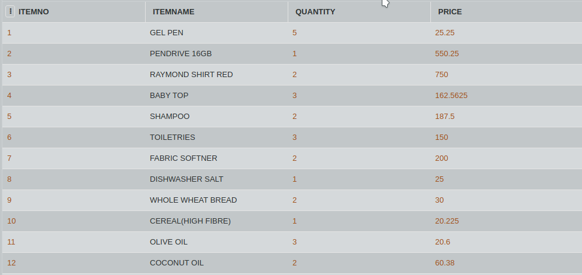

# SQL Challenge- Shopping Expenditure
# DAY SIX
# Challenge Master - Aishwarya 

Daniel bought lots of stuffs from a supermarket nearby. The billing machine did not calculate the total price for each product he bought. Create a new column TOTAL_PRICE which calculates the total price of each product (no. of products * price of each product).

Consider the following table BILL which contains information about the expenditure. Write an SQL query to update the table by adding a new column TOTAL_PRICE and set the column as QUANTITY * PRICE.
Then display the table BILL.

