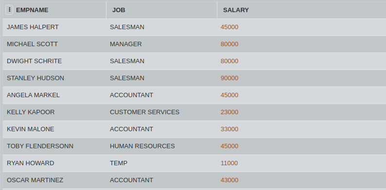

## SQL Challenge - The Office

David Wallace has sent you from the corporate to Dunder Mifflin Scranton branch to get a head count of total people working in each department. He wants to recruit new employees into those departments where head count is less than 3.

Consider the table JOBS. Write an SQL query to display the count values of the column JOB with count value less than 3.
(HINT: Use of HAVE clause)

#### Table: JOBS

