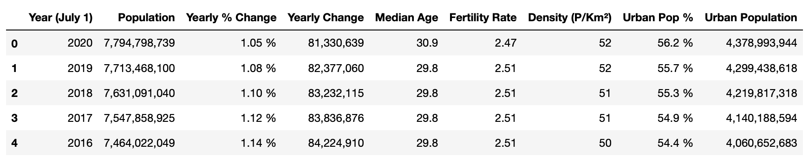

# Challenge - Scrape World Population from Worldometer Website
In this challenge you will have to scrape a table of World Population from WORLDOMETER 
You'll need to make a GET request at the url - https://www.worldometers.info/world-population/. Store the table into a pandas dataframe.

Example: The first 5 rows of the table looks like this - 
 

