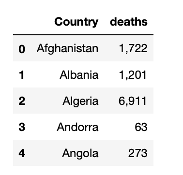

# Challenge - Scrape number of covid deaths by Country
Welcome to today's challenge. In today's challenge we'll be using Selenium which is a very great library that we can use for web automation and extracting data automatically from dynamic pages. For installation guide first refer to the resources.txt file then continue.

In this challenge you have to extract/scrape the total deaths caused by some countries from the website - https://covid19.healthdata.org/

You'll need to make a GET request at the url using selenium .
The 25 countries of which you have to extract the data are provided to you in csv file. 
Your program should do the following:
<li>1 - Visit the url
<li>2 - There is a dropdown selection item which also takes input
<li>3 - Input the country name into this input box from the given csv file
<li>4 - Wait for the page to load
<li>5 - Extract the number of deaths using Beautiful soup and put it in a list
<li>6 - add the list into the dataframe
<li>7 - repeat this for 25 times

The data should look like this -   
 

