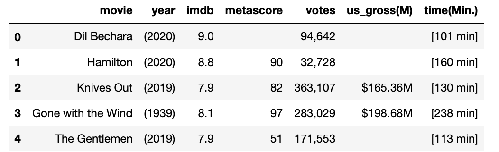

# Challenge - Scrape IMDB top 500 movies
Welcome to today's challenge!!👋

Today I'll put your knowledge to a test.
 Accept this challenge you can do it!! 

In this challenge you will have to make multiple requests to get to different links of the IMDB website.
Your task is to scrape movies information - titles, years, imdb_ratings, metascores, votes, us_gross, time and put it into a dataframe.
 
You'll need to make a GET request at the url - 
url="https://www.imdb.com/search/title/?groups=top_1000&start={x}&ref_=adv_nxt" where "x" is the page number. Make individual requests to 10 pages.

The final output of 5 rows should look like this- 

**Be vigilant and have patience**

