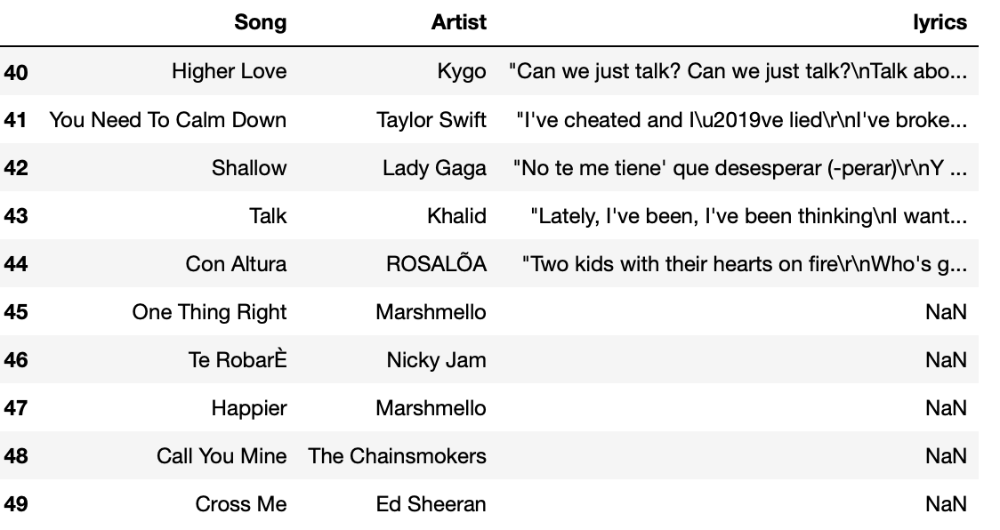

# Challenge - Scrape Songs lyrics 
**WELCOME TO DAY 21**

Today we are going to use an awesome API to extract the lyrics of SPOTIFY'S top rated songs of 2019. 

Visit the website and learn how to use it's API https://lyricsovh.docs.apiary.io/#reference/0/lyrics-of-a-song/search . 
 

Make the **GET** request by providing the API with **artist name** and the **song**. Use the data given in csv format for artists and song names.

Handle for lyrics of songs that the api cannot fetch (not available) by adding the value NaN to that cell of dataframe corressponding to that song. 

Output of the last 10 rows

**Be vigilant and have patience**

