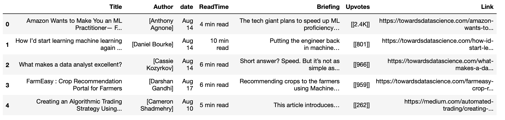

# Challenge - Scrape Medium Articles
## Welcome Back!!

Today you will be extracting data of the blogs from- <a href="https://medium.com/">medium.com</a>.
</>

You need to make get requests to the urls provided to you as a list below and extract information of the blogs.  Save the data into dataframe

list of urls to scrape the data from - 
["https://medium.com/tag/artificial-intelligence",
        "https://medium.com/tag/machine-learning", "https://medium.com/tag/deep-learning"]

You must include the data you can see in this screen shot.

**Go ahead! You got this 👍🏻**