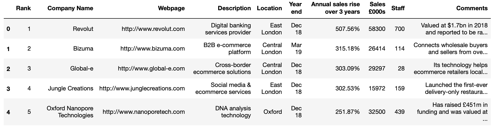

# Challenge - Scrape Top 100 companies
Welcome to today's challenge!!👋

In this challenge you will have to gather data of top 100 companies from the website - <a href="https://www.fasttrack.co.uk">fasttrack.co.uk</a> 
Your task is to scrape companies information such as Rank, Company name, webpage, description, location, year end, annual sales rise, sales, staff, comments and put it into a dataframe.
 

You'll need to make a GET request at the url - 
url="http://www.fasttrack.co.uk/league-tables/tech-track-100/league-table/".

The final output of 5 rows should look like this- 

**Be vigilant and have patience**

