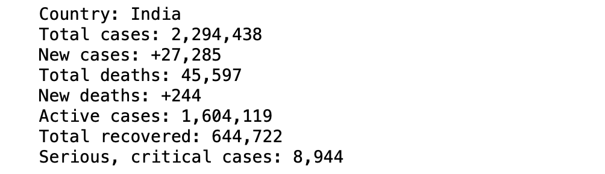

# Challenge - Scrape Corona Status of India 
**WELCOME TO DAY 27**

Today we are going to use Selenium to extract corona virus situation of India from the <b>Worldometer</b> website.  

Make the **GET** request by at the url - https://www.worldometers.info/coronavirus/ using selenium .
and extract information like - 
<li>Country
<li>Total cases
<li>New cases
<li>Total deaths
<li>New deaths
<li>Active cases
<li>Total recovered
<li>Serious, critical cases
 
Simply print this information on the console.

Output should be like this 

<i>*Note: data gets changed as cases increases

