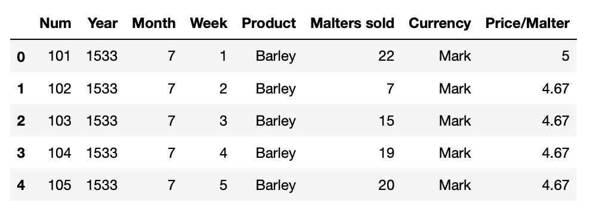

# Challenge - Scrape data from an old website

Getting data is often a challenging task in the field of Data Science/Machine Learning.
Many times one has to scrape data from an old website which could be challenging as the HTML of these sites are often not very concise as compared to today standards.

One such site is [The Medieval and Early Modern Databank](http://www2.scc.rutgers.edu/memdb/index.html)

This site was built in 90s on the practises which were sound at that time.

So in today's challenge we'll be extracting data from the [Prices(Metz)](http://www2.scc.rutgers.edu/memdb/search_form_metzpr.php) database which this site provides.

Actually the problem with this site is that it is a database. So, if you are thinking to scrape the data by calling different urls then please don't. This can't be achieved on this website. 
So, how can we achieve this?
 
"Selenium" to the rescue. This would help us to select the components which would then navigate us to different pages of this website which has the desired data we want.

Your task is to - 
<li>Go to this link using Selenium [Prices(Metz)](http://www2.scc.rutgers.edu/memdb/search_form_metzpr.php)
<li>Click on Submit Query button
<li>Extract the table provided from the current page and the next 4 pages by clicking the next button.
<li>Make a dataframe out of the scraped data.

**Example output** 

**Peace out ✌️**