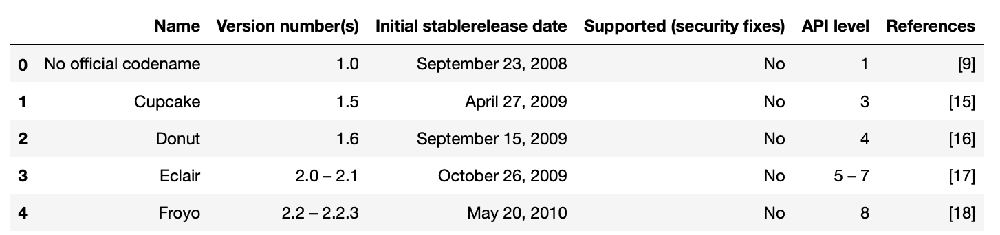

# Challenge - Scrape Android Version History
In this challenge you will have to scrape a table of Android Version History from wikipedia.
You'll need to make a GET request at the url - https://en.wikipedia.org/wiki/Android_version_history and extract the first table on the web-page with class="wikitable" which is the required table to a pandas dataframe.

Example: The first 5 rows of the table looks like this - 
 

