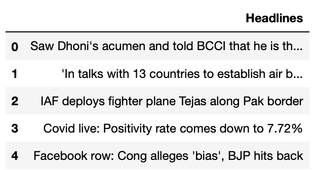

# Challenge - Scrape headlines from Times of India website.
In this challenge you will have to scrape all the headlines from the given url of a newspaper website.

You'll need to make a GET request at the url <a href="https://timesofindia.indiatimes.com/home/headlines">TOI</a> and append these links to a pandas dataframe.

### Sample Output
