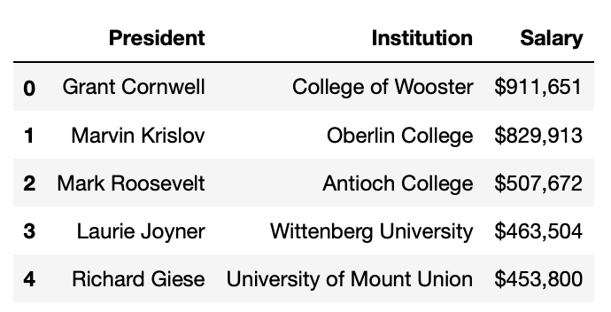

# Challenge - Scrape salaries of private college presidents using REGEX(REGular EXpressions)

In this simple challenge you will be extracting information about salaries of private college presidents in Ohio from the website - <a href="https://www.cleveland.com">cleveland.com</a>.

You need to make a get request at the <a href="https://www.cleveland.com/metro/2017/12/case_western_reserve_university_president_barbara_snyders_base_salary_and_bonus_pay_tops_among_private_colleges_in_ohio.html">url.</a> and extract information of the presidents like their <b>name</b>, <b>institution</b> they studied from and their <b>salaries</b>.

As we can see the information that we need is in form a list. We have to find the information that we need from this unordered list.  
The best & fastest way to achieve this is <b>REGEX</b> (REGular EXpressions).  <i>Learn more about REGEX in the resources. 

**Output**

