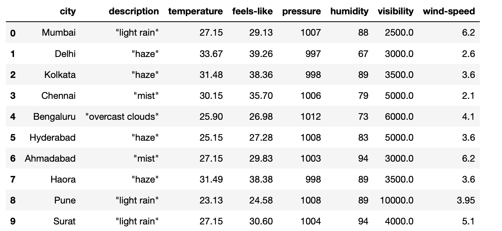

# Challenge - Scrape Weather data
Welcome to today's challenge!!👋

    Let's assume you work for <b>TIMES OF INDIA</b>(newspaper company based in India). 
        TOI wants to publish the ongoing monsoon situation of different states around India in their respective newspapers. You've been appointed to extract this information.

To complete this task you are going to use an awesome API to extract the current weather of Indian states called <b>open weather api</b>. 

Visit the website - https://openweathermap.org/api , signup with your credentials to generate a unique free api key which will act as a password to make api calls for getting info.  
 

Make the **GET** request by providing the API with parameters **city name** and the country iso code which is in our case is "IN". Use the csv file for city names you have to extract the following information about it.
<li>description
<li>temperature(in degree celsius)
<li>feels-like(in degree celsius)
<li>pressure
<li>humidity
<li>visibilty
<li>wind speed

Output of the first 10 rows

<i>Note: Don't worry if some of the last rows of your dataframe have all NaN values. This happens because there is some daily limit set by the API owner if using free API.

