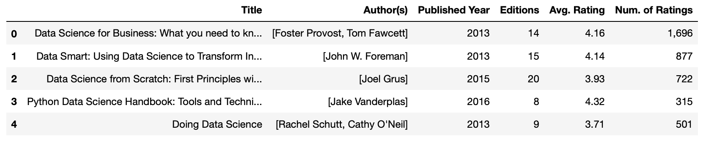

# Challenge - Data Science Books
**WELCOME TO DAY 37**

    lets assume you are working in a group project comprised of 5 people. You all are working on creating a Data science book recommender system.
    As a part of the group you are assigned to scrape books from the website - <a href="https://www.goodreads.com/search">goodreads.com</a>.

Now, there is a search button on the website, fill it with <b>data science</b>. 
Start making get requests to 5 consecutive pages of the website and scrape the data about books such as - Title, Author, Published Year, Editions, Avg. Rating, Number of ratings and store it into a pandas dataframe. 
<b><i>Note: The given information must be extracted using REGEX for eg- finding the rating of books, etc. </i><b>

 
<b>The output dataframe should be like this...</b>

### Go Ahead, You can do it! 👍🏻

