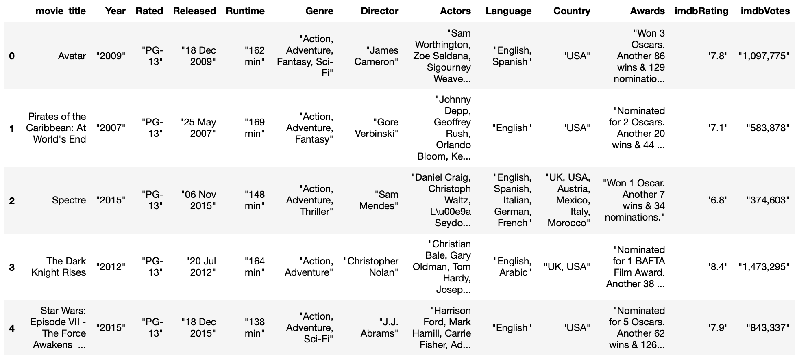

# Challenge - Scrape Movie Details
**WELCOME TO DAY 41** 👋

    lets assume you are working in a group project comprised of 5 people. You all are working on creating a Movie recommender system.
    As a part of the group you are assigned to scrape movies from the API <a href="http://www.omdbapi.com">omdbapi.com</a> so that your team mates could use it to train their models.

Before you get to use their API, you need to generate a unique API key for yourself and thanks to them, it's free of cost for 1000 queries.

<li>Go to this link http://www.omdbapi.com/apikey.aspx
<li>Choose account type as <b>FREE! (1,000 daily limit)</b>
<li>Enter your email address.
<li>Submit
<li>You must have recieved the api key in your email inbox.

Start making get requests to the API by sending the movie name as a parameter(movie titles can be extracted from the csv file included with the challenge) and scrape the data about movies such as - Year, Rated, Released, Runtime, Genre, Director, Actors, Language, Country, Awards, imdbRating, imdbVotes, BoxOffice and store it into a the same pandas dataframe. 

<i>Note: You may need to clean the movie titles from the movies.csv file to avoid api call errors.</i> 
<b>The output dataframe should be like this...</b>

### Go Ahead, You can do it! 👍🏻

