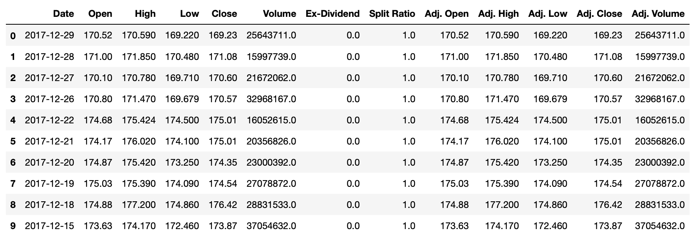

# Challenge - Scrape APPLE stocks
**WELCOME BACK!!**

    Let's assume you work in <b>The Wall Street</b> as a stock broker and it's the year 2018. 
    You want to know about how is the stock behaving for the past year for APPL stock.

To complete this task you are going to use an awesome API to extract the financial data called <b>Financial Data API</b>. 

Visit the website - https://www.quandl.com/tools/api , to learn more about using their API.
 

Make the **GET** request by providing the API with parameters **start date** and **end date** to extract the data for the whole year 2017 starting from 1st Jan 2017 to 1st Jan 2018 and store the data into a pandas dataframe.
  
**The output must be like this having all these columns**

### Go Ahead, You can do it! 👍🏻

