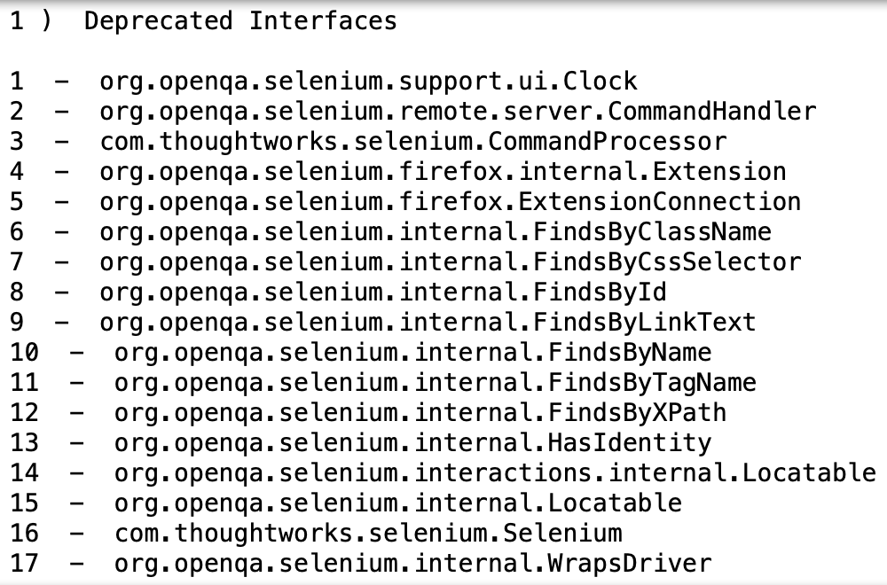

# Challenge - Scrape from iframes.
Welcome to today's challenge!!👋

In today's challenge we'll be using **Selenium** to extract some tables from a <a href="https://www.selenium.dev/selenium/docs/api/java/index.html">website</a> having iframes.  
You might be wondering what are are iframes 🤔 and why do we care to use Selenium on this website 🤷‍♂️, why not only Beautiful soup will do our work.  
The **problem** is with iframes(learn about them in the resources file) which do not let us to access their contents (html) by simply using bs4 because these iframes have all together different HTML from the page source , see them as different websites present in one. That is why we are using **Selenium** for this task.

In this challenge you have to follow these steps using Selenium.

You'll need to make a GET request at the <a href="https://www.selenium.dev/selenium/docs/api/java/index.html">url</a> using selenium . 
<li>1 - Visit the url
<li>2 - There is an iframe having package name on the left side. Switch to this frame (<i>learn more about handling iframes using Selenium</i>)
<li>3 - Click on the org.openqa.selenium link and switch to the default page.
<li>4 - Wait for the page to load
<li>5 - Now switch to the second iframe containing interfaces section.
<li>6 - Click on the WebDriver link and switch to the default page.
<li>7 - Now click the deprecated button present on the top nav bar.
<li>8 - Extract the name of the links which defines what item has been deprecated from all the 6 tables present on the page and print the tables in the format just like the screen shot shows below.
  
Example -   
 

