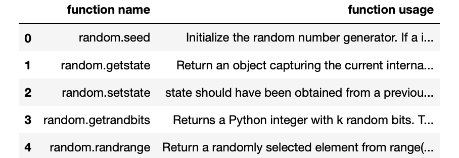

# Challenge - Scrape Python's Random Module functions 

In this challenge you will be extracting python's random module functions from the python documentation.

You need to make a get request at the <a href="https://docs.python.org/3/library/random.html">url.</a> and <b>extract only the functions</b> of the random module from the table using REGEX and store the usernames to a pandas dataframe.
 
Output should be like this - 
 

