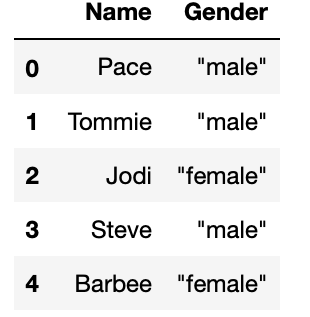

# Challenge - Scrape Gender of a person based on Name
Welcome to today's challenge!!👋

    Let's assume you work in a <b>Company</b> as an intern and it's your first internship. 
    The company has given you the work of conducting some survey from all the 100 employees in the firm. 
    You have completed the survey and found that you haven't kept a record of the gender of a person. This freaks you out because of how silly your mistake is. 
    But you are smart in working with APIs and you know an API that can predict the gender of the person provided his/her name.

The API you are going to use is <a href="https://genderize.io"><b>Genderize API</b>. 
Visit this website to get to know how to use the API

 
You have the names of all the employees as names.csv file.
Make the GET request by providing the API with name parameter to extract their gender and store the data into the pandas dataframe.
  
<i>Note: There is also a value the api returns called "probability" which determines the probability of the name being of a male or female. Consider adding only the predicted gender whose probability is more than <b>0.6</b> otherwise gender should be Unknown.</i> 
**The output must be like this -**  

### Go Ahead, You can do it! 👍🏻

