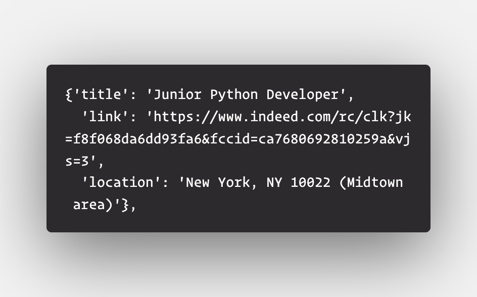

# Challenge - Scraping jobs from Indeed.com
Welcome to today's challenge!!👋

    lets assume you are on a job hunt in New York city.
    You want to get a list of job posting from a well known job hunting site <a href="https://www.indeed.com">indeed.com</a>.

Your Tasks:
<li>Scrape the first 100 available search results
<li>Generalize your code to allow searching for different locations/jobs
<li>Pick out information about the URL, job title, and job location
  
<b>The output should be like this...</b> 

### Go Ahead, You can do it! 👍🏻
