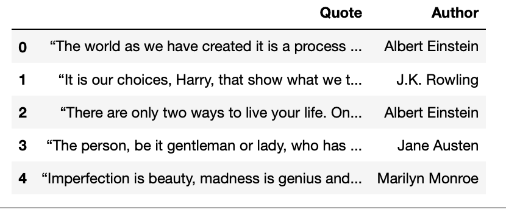

# Challenge - Scrape quotes from infinite scrolling pages
### Welcome to today's challenge!!👋
In this challenge you will have to gather all of the 100 quotes  from the <a href="http://quotes.toscrape.com/scroll">website</a>. 

### Your task 👩🏻‍💻👨🏻‍💻
is to scrape quotes and authors from the page which is infinitely scrolling. As you scroll down the more quotes appear. 
Device a technique to scroll down to the end of the page so that all of the quotes are accessible in the html. Put the data into a dataframe.
 

The final output of 5 rows should look like this- 

 

*hint: Use Selenium*
#### Make sure you have scraped all of the 100 quotes. 
##

