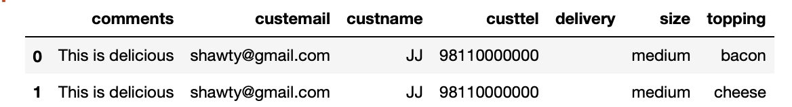

# Challenge - Inputting Forms using Mechanical Soup

A very great feature of Mechanical soup library is that it is very useful when filling out forms or logging in to a website.
In this challenge we'll keep it simple and input the fields of a form using Mechanical Soup.

## Task:
- Make a get request to the <a href="http://httpbin.org/">url</a>
- Navigate to the bottom of the page and select the HTML form link using mech. soup.
- Input the fields using the library and submit the form
- after that you'll get a json format of the form 
- input this data into a pandas dataframe

### Example output - 

### Keep in mind 💡
*MECHANICAL SOUP* is helpful when the input fields we target have name attribute in them but if they not then Selenium is the only way to go.

 *Note: This example has been referenced from the Mechanical soup documentation.*