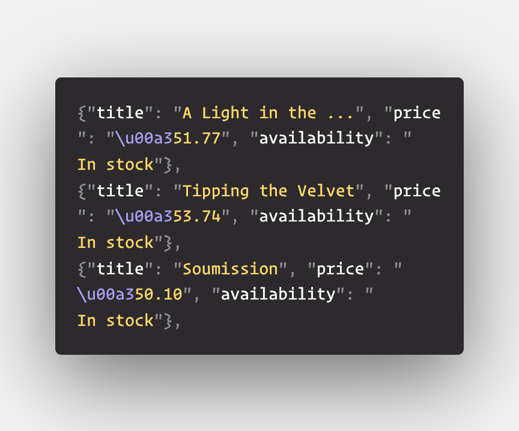

# Challenge - Creating our First Spider
Welcome Back!!👋

You are creating a new books website, for which you need to get data of some popular books available on the internet. So you thought of building a Web Scrapper using that scrapes the the information about books from the [website]("http://books.toscrape.com/catalogue/page-1.html")

 
We are going to again use scrapy for crawling on the [website]("http://books.toscrape.com/catalogue/page-1.html") and extracting data of books from its 50 pages.

Now i am sure you don't wanna specify 50 different urls in the start_requests method. So, to tackle this we will be creating a recursive crawler.

How would you make it ?
 
Learn about this following this [link]("https://docs.scrapy.org/en/latest/intro/tutorial.html#following-links").

### Now get your hands dirty 🏋️‍♀️

## Task 👨🏻‍💻👩🏻‍💻
- Make a get request to the first page [url]("http://books.toscrape.com/catalogue/page-1.html")
- parse the data using the parse method and scrape data like - ***title of the book, price and availability and yield a json object containing the data***.
- make recursive calls to the next page of the website until there is no further page available
- finally run the web crawler with specifying the command - **scrapy crawl "name_of_spider" -o books.json** in your root directory of the project to save the file as a json.

The file should have the contents starting something like - 
 

Make sure you are scraping all the 50 pages.

### BOOM 💥💥💥
YOU CAN SCRAPE 50 PAGES OF A WEBSITE IN SUCH A SHORT PERIOD OF TIME
##

