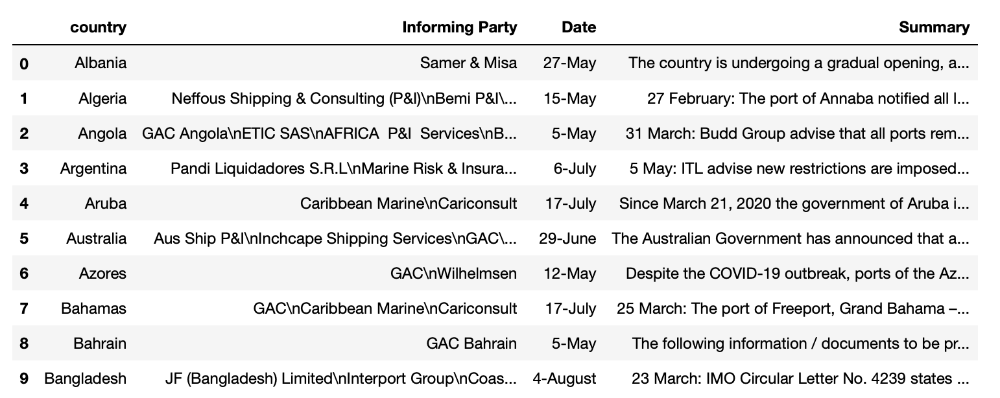

# Challenge - Scrape data for Coronavirus Outbreak – Impact on Shipping.

You are working as an operations manager in a Sea port company having clients across the world. Amid Covid-19 pandemic many shipping companies have stopped shipping through sea routes and some have made some rules and regulations to carry on the work. 

To restart the working of your company you have been provided with a task to collect movement information about different sea ports.
Scrape the data of country, the information party, date and summary from the url - "https://www.nepia.com/publications/covid-19-coronavirus-outbreak-impact-on-shipping/" and store it into a pandas dataframe.

The data should look like this.

