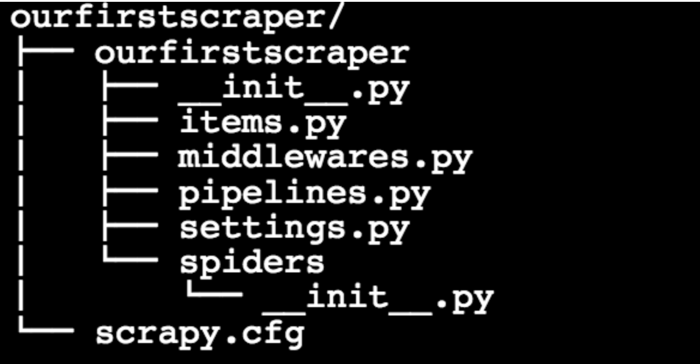

# Challenge - Creating our First Spider
Welcome Back!!👋

Today we are going to be using a very quick and powerful library for scraping called **SCRAPY**.  
###### Trust me it isn't Scary 🎃 It's Scrapy

Scrapy is one of the most popular Python web scraping libraries right now. It is an open-source framework. This means it is not even a library, it's rather a complete tool that you can use to scrape and crawl around the web systematically.

Scrapy is designed to build web spiders that can crawl the web on their own.

###### For installation guide, setting up a scrapy project and learning how to use scrapy refer to the resources.txt file.

## Task 👨🏻‍💻👩🏻‍💻
- Start of by making a scrapy project
- in the spiders directory make your python file 
###### Folder Structure:
 
- make a class inheriting spider class and name your spider
- specify the urls - ["http://quotes.toscrape.com/page/1/",
"http://quotes.toscrape.com/page/2/","http://quotes.toscrape.com/page/3/",]   in the start_requests method inside the spider class to scrape from.
- parse the data using the parse method and scrape data like - ***text, authors and tags from each quote and yield a json object containing the data***.
- finally run the web crawler with specifying the command - **scrapy crawl "name_of_spider" -o quotes.json** in your root directory of the project to save the file as a json.

The file should have the contents starting something like - 
 

##
