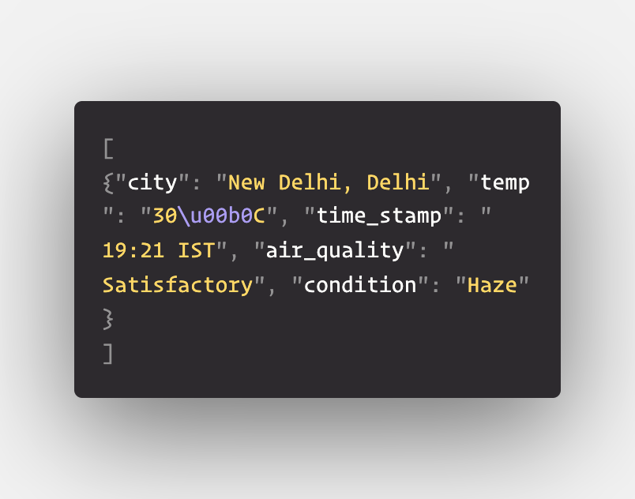

# Challenge - Scraping Weather of a city with Scrapy & Selenium
Welcome Back!!👋

Assume you are working on a weather application which shows weather data of different cities of India. You don't want to use any api to fetch the data so you decided to crawl <a href="https://weather.com">weather.com</a> and scrape real-time data for your project. 

We are going to again use scrapy for crawling on the <a href="https://weather.com">website</a> and extracting weather data of cities like - New delhi, Pune, Jaipur, Mumbai, Goa and Patiala.

### Time to train some finger muscels 🏋️‍♀️

## Task 👨🏻‍💻👩🏻‍💻
- Make a get request to the url having that city's weather info.
- parse the data using the parse method and scrape data like - ***city,temp, time_stamp, air_quality and condition*** and yield a json object containing the data.
- make recursive calls to the parse method containing url of the next page of the website containing a different city until there is no further city available. You need to type the city in the search input so it's recommended to use **Selenium** for this task.
- finally run the web crawler with specifying the command - **scrapy crawl "name_of_spider" -o weather.json** in your root directory of the project to save the file as a json.

The file should have the contents starting something like - 
 

Make sure you are scraping all the given cities.

### You got this, Come on!! 💥💥💥
##

