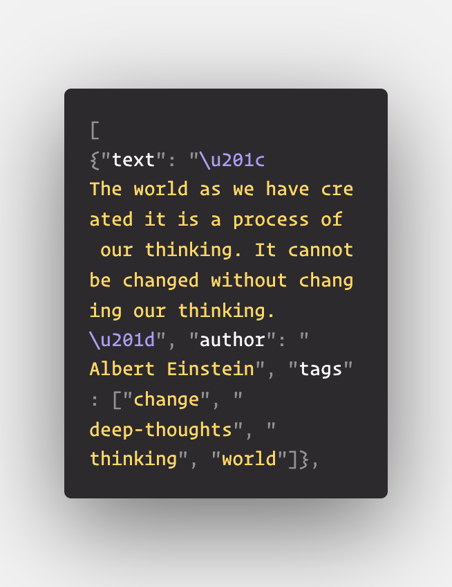

# Challenge - Filling out a login form using scrapy 

This challenge is very similar to the first project that we made using scrapy. Just, we have to now first login to the <a href="http://quotes.toscrape.com/login">website</a> to scrape the quotes 📝.

🚨🚨🚨🚨While logging in to the website a ***csrf token*** is generated for security purposes 🚨🚨🚨🚨.

There is a class in scrapy module named <a href="https://docs.scrapy.org/en/latest/topics/request-response.html?highlight=formrequest#formrequest-objects">FormRequest</a> which could help us handling such forms(login page).

###### learn more about csrf <a href="https://stackoverflow.com/questions/5207160/what-is-a-csrf-token-what-is-its-importance-and-how-does-it-work">here</a>

## Task 👨🏻‍💻👩🏻‍💻
- Start of by making a scrapy project
- in the spiders directory make your "solutions.py" python file
- make a class inheriting spider class and name your spider
- specify the url to the login page of the website - http://quotes.toscrape.com/login .
- create a FormRequest in the parse method and pass in the parameters such as - **csrf_token**, **username** (it will accept any value) and **password** (it will accept any value)
- parse the data and scrape data from only the first page of the website like - ***text, authors and tags from each quote and yield a json object containing the data***.
- finally run the web crawler with specifying the command - **scrapy crawl "name_of_spider" -o quotes.json** in your root directory of the project to save the file as json.

The file should have the contents starting something like - 
 

##
