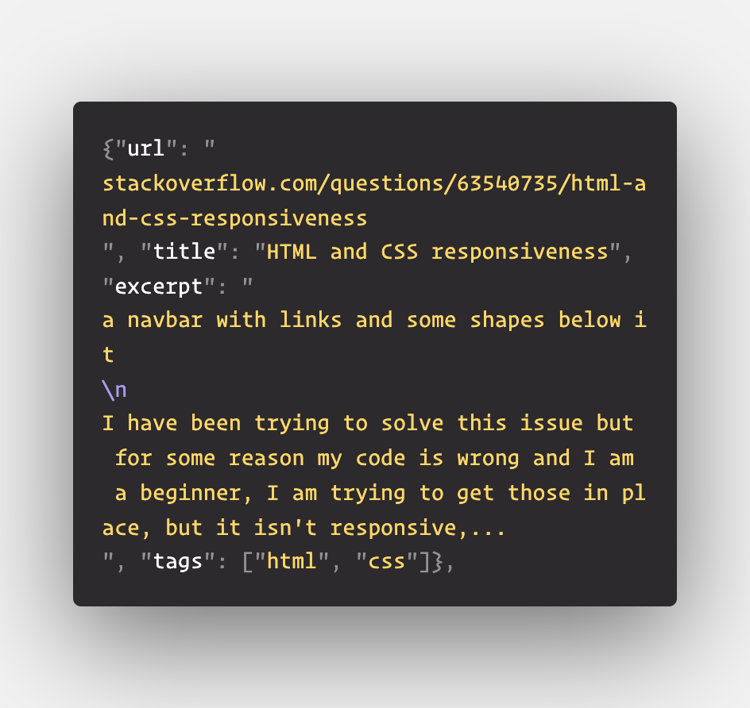

# Challenge - Scraping Stackoverflow Questions with Scrapy
Welcome Back!!👋

Assume you are stackoverflow developer who is very enthusiastic in solving people's queries. Obviously you would only want to answer those questions that lie in your domain. So you thought of building a Web Scraper that scrapes the information about newest stackoverflow questions❓from the <a href="https://stackoverflow.com/questions?tab=newest&page=1">SO website</a>.

We are going to again use scrapy for crawling on the <a href="https://stackoverflow.com/questions?tab=newest&page=1">website</a> and extracting questions from first 5 pages only.

## Task 👨🏻‍💻👩🏻‍💻
- Make a get request to the first page <a href="https://stackoverflow.com/questions?tab=newest&page=1">url</a>
- parse the data using the parse method and scrape data of the question like - ***title, url of the question,  excerpt, tags*** and yield a json object containing the data.
- make recursive calls to the next page of the website until you arrive at the 5th page.
- finally run the web crawler with specifying the command - **scrapy crawl "name_of_spider" -o questions.json** in your root directory of the project to save the file as a json.

The file should have the contents starting something like - 
 

#

