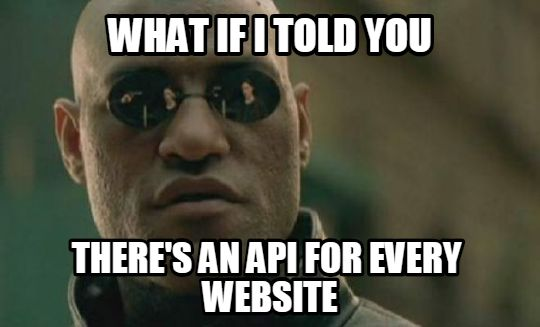
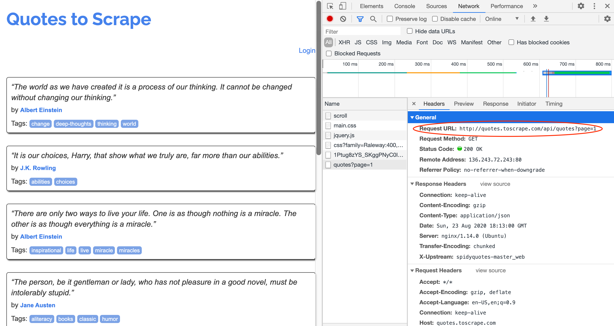
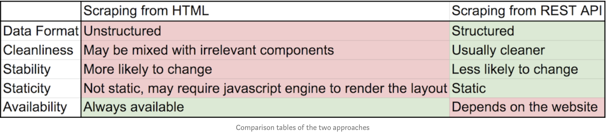

# Challenge - Scraping Quotes by using Hidden APIs
## Welcome Back!!👋

We have scraped quotes from <a href="http://quotes.toscrape.com/scroll">toscrape.com</a>. We have had always tried to find the html tags for scraping the data..............YET!
<pre align="center">

</pre>
There is a better way of doing this task. <a href="http://quotes.toscrape.com/scroll">toscrape.com</a> website has a hidden api which gives a json object of the data and we can use it to scrape the information that we need.

As this <a href="http://quotes.toscrape.com/scroll">website</a> is infinitely scrolling one ,we need to understand how the infinite scrolling works on this page and we can do so by using the Network panel in the Browser's developer tools. Open the panel and then scroll down the page to see the requests that the browser is firing:
<pre align="center">

</pre>
Click on a request for a closer look. The browser sends a request to /api/quotes?page=x and then receives a JSON object like this in response:

<pre>
{'has_next': True,
 'page': 1,
 'quotes': [{'author': {'goodreads_link': '/author/show/9810.Albert_Einstein',
    'name': 'Albert Einstein',
    'slug': 'Albert-Einstein'},
   'tags': ['change', 'deep-thoughts', 'thinking', 'world'],
   'text': '“The world as we have created it is a process of our thinking. It cannot be changed without changing our thinking.”'},
</pre>

This is the information we need for our spider. All it has to do is generate requests to "/api/quotes?page=x" for an increasing x until the has_next field becomes false. The best part of this is that we don't even have to scrape the HTML contents to get the data we need. It's all in a beautiful machine-readable JSON.

## HTML VS REST API
<pre align="center">

</pre>

## Task 👨🏻‍💻👩🏻‍💻
- Make a get request to the api having parameter page 1 <a href="http://quotes.toscrape.com/api/quotes?page=1">url</a>
- In the parse method scrape the quotes, authors and tags. Yield the dictionary.
- Scrape all of the 100 quotes.
- finally run the web crawler with specifying the command - **scrapy crawl "name_of_spider"** -o quotes.json.

The data in quotes.json should look like this - 
<pre>[
{"author_name": "Albert Einstein", 
"text": "\u201cThe world as we have created it is a process of our thinking.
 It cannot be changed without changing our thinking.\u201d",
  "tags": ["change", "deep-thoughts", "thinking", "world"]},</pre>
#

